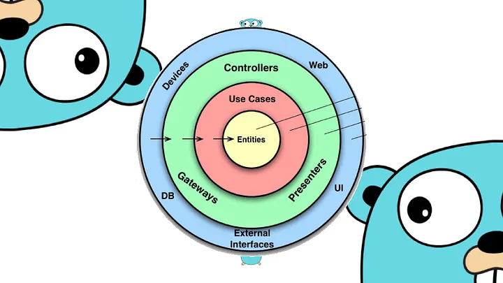

Email Service
============

Leyniker Rivera, ing.leyniker.rivera@gmail.com, 10/18/2023

Un servicio que acepta la información necesaria y envía correos electrónicos. Debe proporcionar una abstracción entre dos proveedores de servicios de correo electrónico diferentes. Si uno de los servicios falla, tu servicio puede cambiar rápidamente a otro proveedor sin afectar a tus clientes.

## Ruta técnica
back-end

¿Cómo usar este servicio?
Las API del servicio es una API RESTful

Las principales llamadas a la API deben hacerse mediante HTTP POST.

### API Principal
URL:
/send

No hay una interfaz de usuario para este proyecto. Es una API REST. Es accesible a través de solicitudes HTTP POST y espera un objeto JSON como entrada. También devolverá un objeto como salida.

method: POST

Entrada:
- asunto del correo electrónico
- contenido del correo electrónico (el asunto y el contenido del correo electrónico no pueden estar ambos vacíos)

Formato de entrada: JSON

<table>
<thead>
<tr>
<th>Clave JSON</th>
<th>Significado</th>
</tr>
</thead>
<tbody>
<tr><td>to_email</td><td>cadena o lista, la(s) dirección(es) de correo electrónico en "para"</td></tr>
<tr>
<td>subject</td><td>el asunto del correo electrónico</td>
</tr>
<tr><td>body</td>
<td>contenido completo en texto del correo electrónico a enviar</td>
</tr></tbody>
</table>

A continuación se muestra un ejemplo de entrada en formato JSON.
```
{
    "data": {
        "to_email": "lrivera@yopmail.com",
        "subject": "test subject",
        "body": "This is the test text as the email content. Again, this is the test text as the email content."
    }
}
```

Respuesta:
- status code
- message
- date

output format: json

Following is a sample output json:
```
{
    "status": 200,
    "message": "Successfully sent email.",
    "date": "Mon Jan _2 15:04:05 MST 2006"
}
```
Esto es para una transacción exitosa.


##Testing
No hay una interfaz de usuario (UI) para este proyecto. Puede ser probado a través de curl o cualquier herramienta que pueda enviar solicitudes HTTP POST.

A continuación se presenta el scripts para probar el servicio:

Enviar correo electrónico a una dirección.

- send email to one address
```
curl --location --request POST 'localhost:8080/send' \
--header 'Content-Type: application/json' \
--data-raw '{
    "data": {
        "to_email": "ing.leyniker.rivera@gmail.com",
        "subject": "test subject",
        "body": "This is the test text as the email content. Again, this is the test text as the email content."
    }
}'
 
```
output:
```
{
    "status": 200,
    "message": "Successfully sent email.",
    "date": "Mon Jan _2 15:04:05 MST 2006"
}
```

##Arquitectura limpia




##Diagrama de componentes


##Diagrama de secuencias


##Diagrama de caso de uso


##Nota 

importante Configurar las variables de entorno.

SENDGRID_APIKEY=

SENDGRID_FROM_EMAIL=

SENDGRID_USER_NAME=